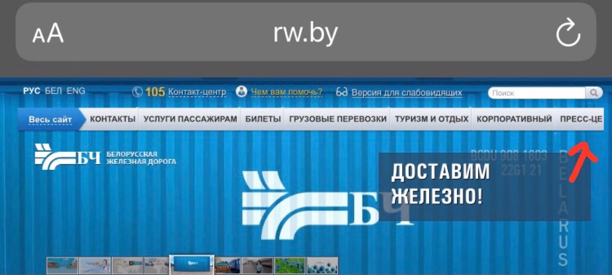

# Bug-Report
Bug description
____
## Bug ID: 1
# Summary: Checking of the website rw.by from mobile.
# Description: Checking of the GUI of the website rw.by from mobile.
# Act.: Cosmetic flaw of the head of the main page in the right upper corner of the website rw.by from mobile (Iphone 8, 14.4.2). Cut the name.
# Exp.: Correct name of the button.
# Steps to reproduce: 
1. Open website rw.by from mobile;
2. Bug appears.
# Severity: Medium.
# Attachmet: 

## Bug ID: 2
# Summary: Checking of the functionality of the website uslugi.yandex.ru.
# Description: Checking of the functionality of the "Взять заказ - Добавить отклик" of the website uslugi.yandex.ru.
# Act.: Adding of the comment and putting of the attachments after clicking of the button "Добавить отклик" of the website uslugi.yandex.ru leads to server error "Ошибка модерации. Недопустимый текст"
# Exp.: Adding of the comment and putting of the attachments are published in the website uslugi.yandex.ru.
# Steps to reproduce: 
1. Open uslugi.yandex.ru;
2. Go to "Взять заказ - Добавить отклик"
3. Put text in the text field and click "Добавить"
4. Bug appears.
# Severity: High.
