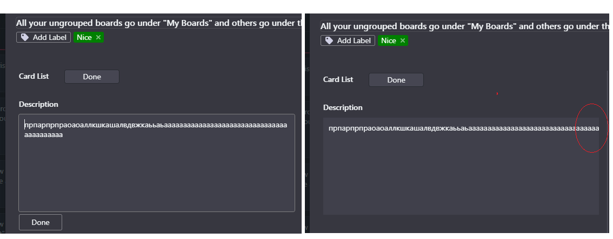

# Bug-Report
Bug description
____
## Bug ID: 1
# Summary: Checking of the website rw.by from mobile.
# Description: Checking of the GUI of the website rw.by from mobile.
# Act.: Cosmetic flaw of the head of the main page in the right upper corner of the website rw.by from mobile (Iphone 8, 14.4.2). Cut the name.
# Exp.: Correct name of the button.
# Steps to reproduce: 
1. Open website rw.by from mobile;
2. Bug appears.
# Severity: Medium.
# Attachmet: 

## Bug ID: 2
# Summary: Checking of the functionality of the website uslugi.yandex.ru.
# Description: Checking of the functionality of the "Взять заказ - Добавить отклик" of the website uslugi.yandex.ru.
# Act.: Adding of the comment and putting of the attachments after clicking of the button "Добавить отклик" of the website uslugi.yandex.ru leads to server error "Ошибка модерации. Недопустимый текст"
# Exp.: Adding of the comment and putting of the attachments are published in the website uslugi.yandex.ru.
# Steps to reproduce: 
1. Open uslugi.yandex.ru;
2. Go to "Взять заказ - Добавить отклик"
3. Put text in the text field and click "Добавить"
4. Bug appears.
# Severity: High.

## Bug ID: 3
# Summary: Checking of the functionality of the ranked match of the RPG MOBA (Mobile Legends app) from mobile device.
# Description: Сhecking how a hero is selected in a ranked match RPG MOBA (Mobile Legends app) from mobile device (Iphone 8, 14.4.2).
# Act.: The hero in ranked match has already been selected randomly.
# Exp.: The player should have oppotunity to select hero by himself.
# Steps to reproduce: 
1. Open Mobile Legends app on mobile device;
2. Go to ranked match, wait for acceptance, click button "accept'.
3. Bug appears.
# Severity: Medium.
Comment: after last update this  bug was fixed.

## Bug ID: 4
# Summary: Checking of the items of the Brisqi app.
# Description: Opotunity to add description/comments in the text field of the item in the Brisqi app.
# Act.: The text is truncated when you enter 50 + characters in the text field of the item in the Brisqi app.
# Exp.: The text is put fully in the text field of the item in the Brisqi app.
# Steps to reproduce: 
1. Open Brisqi app;
2. Open any item;
3. Put more than 50+ symbols in the text field of the description/comment section and click button "add";
4. Bug appears.
# Severity: Medium.

## Bug ID: 5
# Summary: Checking of the fuctionality of АИС СОЮ (Автоматизированная информационная система судов общей юрисдикции).
# Description: Cheking of the switching from one user to another. 
# Act.: Switching from one user to another leads to incorect avatar display (shows avatar of the previous user).
# Exp.: Switching from one user to another leads to correct display of avatar (current user).
# Steps to reproduce: 
1. Open web app;
2. Authorization (Login, password);
3. Click from main menu dropdown list button "exit';
4. Authorize another user (Login, password);
5. Bug appears.
# Severity: Medium.

